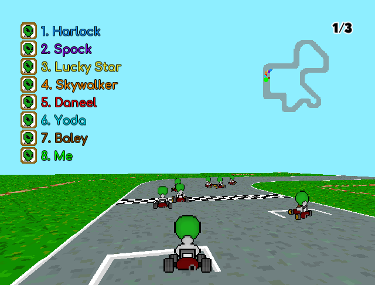

# Alien Kart Race

A pseudo 3D racing car game written in C++/SFML for an university project. 

---

## Get me!
Open a terminal in a directory and type
```
git clone https://github.com/Docheinstein/alien-kart-race
```

## Requirements

##### SFML

The game uses SFML 2.4.2 as graphics library, which is included as a static library.

##### C++11
The game needs the C++11 to be compiled.

## Compile
Open a terminal in the project directory and type:
```
make
```

## Run
Open a terminal in the project directory and type:
```
make run
```

## What it looks like

